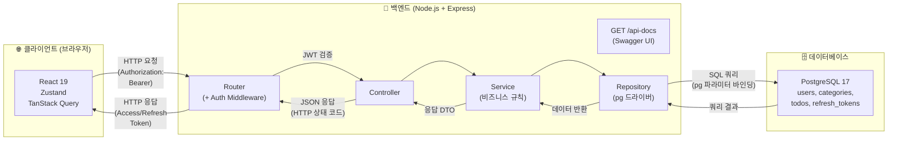
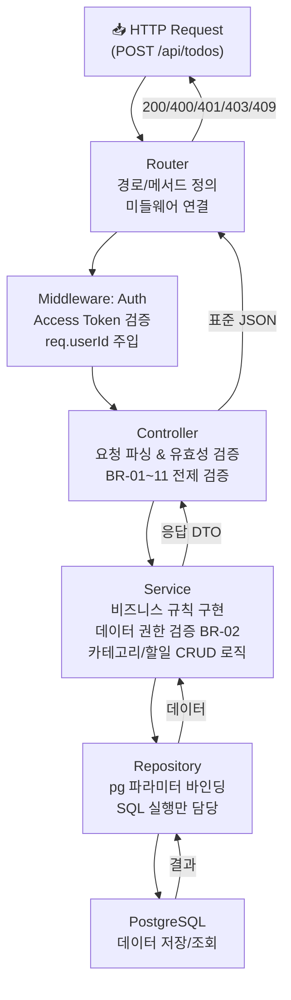
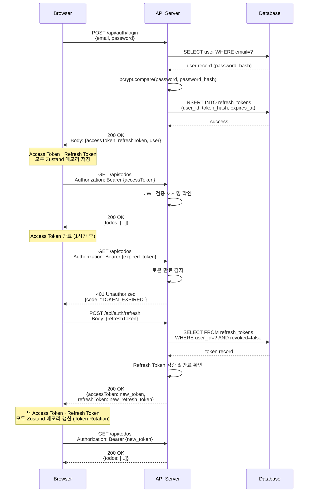
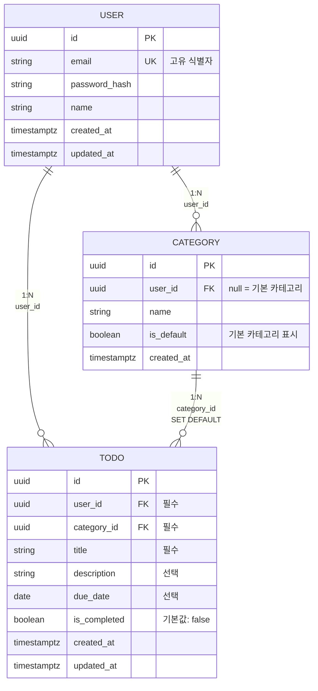

# 기술 아키텍처 다이어그램 — TodoListApp

**버전:** 1.3  
**작성일:** 2026-05-13  
**참조 문서:** `2-prd.md` v1.1, `4-project-principles.md` v1.0

## 변경 이력

| 버전 | 날짜 | 작성자 | 변경 내용 |
|------|------|--------|-----------|
| 1.3 | 2026-05-14 | kimhj | §3 토큰 재발급 응답에 refreshToken 추가(Rotation), §1에 /api-docs(Swagger UI) 추가 |
| 1.2 | 2026-05-13 | kimhj | 인증 토큰 저장 방식 변경 — Refresh Token을 httpOnly 쿠키 → Zustand 메모리로 전환, §1·§3 다이어그램 수정 |
| 1.1 | 2026-05-13 | kimhj | §1 Middleware 별도 박스 제거(Router에 통합), §4 USER.display_name → name 수정 |
| 1.0 | 2026-05-13 | kimhj | 최초 작성 |

---

## 1. 전체 시스템 구성 (3계층 아키텍처)

전체 시스템을 클라이언트, 백엔드 API, 데이터베이스 3계층으로 표현한 고수준 개요도입니다.

---

## 2. 백엔드 5계층 구조

HTTP 요청부터 데이터베이스 접근까지의 명확한 수직 흐름을 표현한 백엔드 레이어 다이어그램입니다.

---

## 3. JWT 인증 및 토큰 재발급 흐름

로그인(UC-02)과 토큰 재발급(UC-02b)의 전체 시퀀스를 표현한 인증 흐름 다이어그램입니다.

---

## 4. 데이터 모델 (Entity Relationship Diagram)

사용자, 카테고리, 할일 세 핵심 엔티티의 관계를 표현한 데이터 모델 다이어그램입니다.

---

*본 아키텍처 다이어그램은 `2-prd.md` v1.1과 `4-project-principles.md` v1.0을 기반으로 작성되었으며, 개발 진행에 따라 버전 관리를 통해 업데이트된다.*
