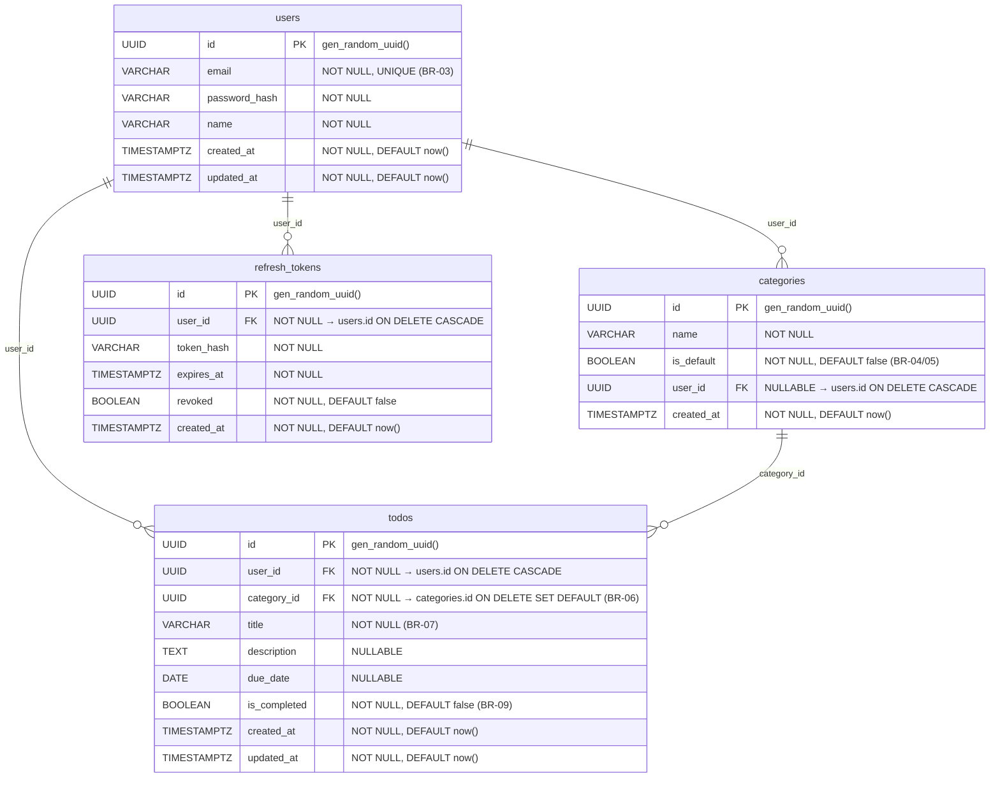

# ERD (Entity Relationship Diagram)

- **버전**: 1.0
- **작성일**: 2026-05-13
- **참조 문서**: `2-prd.md` v1.3, `1-domain-definition.md` v1.0

## 변경 이력

| 버전 | 날짜 | 작성자 | 내용 |
|------|------|--------|------|
| 1.0 | 2026-05-13 | kimhj | 최초 작성 |

---

## 1. 메인 ERD

> **관계 설명**
>
> - `users ||--o{ todos` : 한 명의 사용자는 0개 이상의 할 일을 소유한다. 사용자 삭제 시 관련 todos 모두 삭제(ON DELETE CASCADE).
> - `users ||--o{ categories` : 한 명의 사용자는 0개 이상의 사용자 정의 카테고리를 소유한다. `user_id IS NULL`인 카테고리는 시스템 기본 카테고리이며 이 관계에서 제외된다.
> - `users ||--o{ refresh_tokens` : 한 명의 사용자는 0개 이상의 리프레시 토큰을 가진다. 사용자 삭제 시 관련 토큰 모두 삭제(ON DELETE CASCADE).
> - `categories ||--o{ todos` : 하나의 카테고리는 0개 이상의 할 일을 포함한다. 카테고리 삭제 시 소속 todos의 `category_id`는 시스템 기본 카테고리로 변경된다(ON DELETE SET DEFAULT).

---

## 2. 인덱스 설계

| 인덱스명 | 테이블 | 컬럼 | 종류 | 목적 |
|----------|--------|------|------|------|
| `users_email_key` | users | email | UNIQUE | BR-03 이메일 중복 방지 및 로그인 조회 성능 |
| `idx_todos_user_id` | todos | user_id | B-Tree | 사용자별 할 일 목록 조회 성능 |
| `idx_todos_category_id` | todos | category_id | B-Tree | 카테고리별 할 일 조회 성능 및 FK 참조 |
| `idx_categories_user_id` | categories | user_id | B-Tree | 사용자별 카테고리 목록 조회 성능 |
| `idx_refresh_tokens_user_id` | refresh_tokens | user_id | B-Tree | 사용자별 토큰 조회 및 일괄 무효화 성능 |
| `idx_refresh_tokens_token_hash` | refresh_tokens | token_hash | B-Tree | 토큰 검증 시 해시값 기반 단건 조회 성능 |

---

## 3. 비즈니스 규칙 매핑

| BR 번호 | 규칙 설명 | 테이블 | 컬럼 | 적용 제약 조건 |
|---------|----------|--------|------|---------------|
| BR-03 | 이메일은 시스템 전체에서 유일해야 한다 | users | email | `UNIQUE`, 인덱스 `users_email_key` |
| BR-04 | 기본 카테고리는 시스템이 제공하며 사용자가 삭제할 수 없다 | categories | is_default, user_id | `is_default = true`, `user_id IS NULL` |
| BR-05 | 사용자 정의 카테고리는 특정 사용자에게 귀속된다 | categories | is_default, user_id | `is_default = false`, `user_id IS NOT NULL`, FK → users.id |
| BR-06 | 할 일은 반드시 하나의 카테고리에 속해야 한다 | todos | category_id | `NOT NULL`, FK → categories.id `ON DELETE SET DEFAULT` |
| BR-07 | 할 일의 제목은 필수 입력 항목이다 | todos | title | `NOT NULL` |
| BR-09 | 할 일 완료 처리는 삭제가 아닌 상태 변경으로 관리한다 | todos | is_completed | `BOOLEAN NOT NULL DEFAULT false`, 소프트 상태 관리 |
