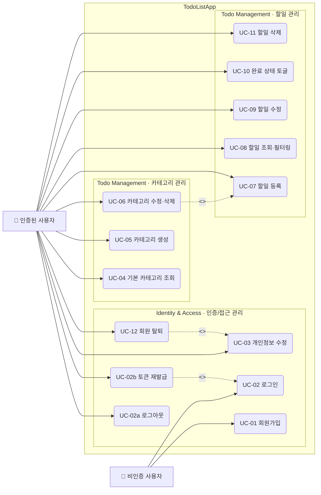

# USE CASE Diagram — TodoListApp

**버전:** 1.0  
**작성일:** 2026-05-13  
**참조 문서:** `2-prd.md` v1.1

## 변경 이력

| 버전 | 날짜 | 작성자 | 변경 내용 |
|------|------|--------|-----------|
| 1.0 | 2026-05-13 | kimhj | 최초 작성 |

---

## 다이어그램

---

## 액터 정의

| 액터 | 설명 |
|------|------|
| 비인증 사용자 | 미인증 상태의 방문자. 회원가입(UC-01)과 로그인(UC-02)만 수행 가능 |
| 인증된 사용자 | JWT 로그인 완료 후 모든 기능에 접근 가능한 사용자 |

---

## 유스케이스 목록

### Identity & Access

| UC | 이름 | 요약 |
|----|------|------|
| UC-01 | 회원가입 | 이메일·비밀번호로 계정 생성, 가입 즉시 JWT 발급 |
| UC-02 | 로그인 | 이메일·비밀번호 검증 후 Access Token + Refresh Token 발급 |
| UC-02a | 로그아웃 | Refresh Token 서버 무효화, Zustand 메모리(Access Token·Refresh Token·사용자 정보) 초기화 |
| UC-02b | 토큰 재발급 | Access Token 만료 시 Refresh Token으로 재발급 (UC-02 extend) |
| UC-03 | 개인정보 수정 | 표시 이름 및 비밀번호 변경. 비밀번호 변경 시 현재 비밀번호 확인 필수 |
| UC-12 | 회원 탈퇴 | 비밀번호 재입력 확인(UC-03 include) 후 계정·데이터 즉시 삭제 |

### 카테고리 관리

| UC | 이름 | 요약 |
|----|------|------|
| UC-04 | 기본 카테고리 조회 | 전체 사용자 공통 카테고리 목록 조회. 수정·삭제 불가 |
| UC-05 | 카테고리 생성 | 사용자 정의 카테고리 이름 입력 후 생성 |
| UC-06 | 카테고리 수정·삭제 | 본인 생성 카테고리만 대상. 삭제 시 소속 할일은 기본 카테고리로 자동 이동(UC-07 include) |

### 할일 관리

| UC | 이름 | 요약 |
|----|------|------|
| UC-07 | 할일 등록 | 제목 필수, 설명·종료예정일·카테고리 선택 입력 |
| UC-08 | 할일 조회·필터링 | 카테고리·기간·완료 여부 단독 및 복합 필터 |
| UC-09 | 할일 수정 | 본인 할일 내용 수정, `updated_at` 갱신 |
| UC-10 | 완료 상태 토글 | 완료 ↔ 미완료 전환, 데이터 삭제 없음 |
| UC-11 | 할일 삭제 | 본인 할일 영구 삭제 |

---

## 관계 범례

| 표기 | 종류 | 의미 |
|------|------|------|
| `→` 실선 | Association | 액터가 유스케이스에 참여 |
| `-.->` 점선 `<<extend>>` | Extend | 조건 충족 시 선택적으로 실행되는 확장 유스케이스 |
| `-.->` 점선 `<<include>>` | Include | 기본 유스케이스 실행 시 반드시 포함되는 유스케이스 |

### include / extend 관계 설명

| 관계 | 설명 |
|------|------|
| UC-02b `<<extend>>` UC-02 | Access Token 만료 시 로그인 흐름을 연장하여 자동 재발급 |
| UC-12 `<<include>>` UC-03 | 회원 탈퇴 시 개인정보 수정의 비밀번호 확인 절차를 반드시 포함 |
| UC-06 `<<include>>` UC-07 | 카테고리 삭제 시 소속 할일의 카테고리를 기본값으로 이동(할일 등록 규칙 재적용) |
